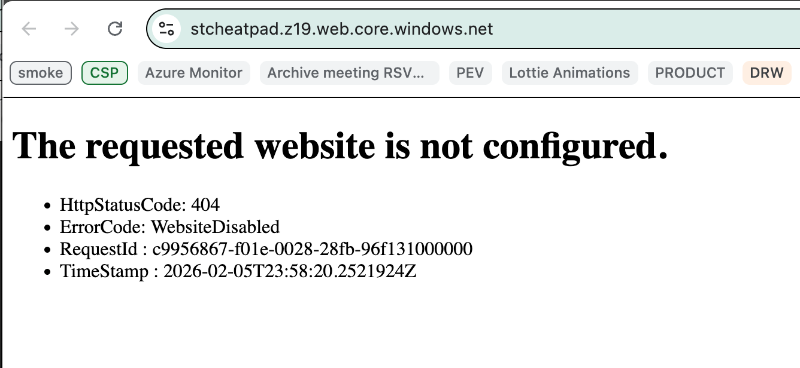

# cheatpad

"Cheatsheets for iPad" => CheatPad

This project uses [Azure Storage](https://learn.microsoft.com/en-us/azure/storage/blobs/storage-blob-static-website-how-to?tabs=azure-cli) to host individual cheetsheet pages as blobs in a special $web container.

## Configure Storage Account

See associated `./config.sh` file.

## Troubleshooting

Some steps you may need to take if `./config.sh` did not do everything on the first go.

### Be sure to wait a minute if you initially get this error



### Be sure you can run the config script

```bash
chmod u+x ./config.sh
./config.sh
```

### Ask Azure Storage to confirm

NB: environment variables not used in these examples.

```bash
az storage blob service-properties show --account-name stcheatpad --query "staticWebsite"
az storage account show -n stcheatpad -g rg-cheatpad --subscription "EffAz-Prod" --query "primaryEndpoints.web" -o tsv
```

## Metrics

After storage is configured, [metrics can be enabled within the Azure Portal](https://learn.microsoft.com/en-us/azure/storage/blobs/storage-blob-static-website-how-to?tabs=azure-cli#enable-metrics-on-static-website-pages).
